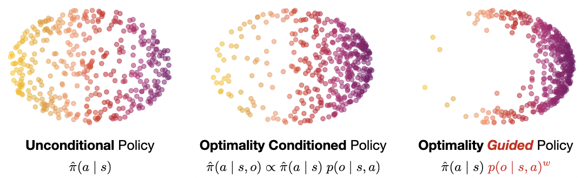

# Diffusion Guidance Is a Controllable Policy Improvement Operator

**Kevin Frans**, **Seohong Park**, Pieter Abbeel, Sergey Levine

ArXiv: (Coming Soon)

At the core of reinforcement learning is the idea of learning beyond the performance in the data. However, scaling such systems has proven notoriously tricky. In contrast, techniques from generative modeling have proven remarkably scalable and are simple to train. 
In this work, we combine these strengths, by deriving a direct relation between policy improvement and guidance of diffusion models. The resulting framework, CFGRL, is trained with the simplicity of supervised learning, yet can further improve on the policies in the data.
On offline RL tasks, we observe a reliable trend---increased guidance weighting leads to increased performance. Of particular importance, CFGRL can operate without explicitly learning a value function, allowing us to generalize simple supervised methods (e.g., goal-conditioned behavioral cloning) to further prioritize optimality, gaining performance for ``free'' across the board.



## Replicating experiments

Our experiments are conducted over two RL libraries -- [RLBase](https://github.com/kvfrans/rlbase/) for the ExORL experiments, and [OGBench](https://github.com/seohongpark/ogbench/) for the goal-conditioned and additional single-task experiments. See:

* `rlbase/` for the offline RL experiments on ExORL.
* `ogbench/` for the goal-conditioned BC experiments on OGBench.

Our contributions are located in `rlbase/algs_offline/iql_diffusion.py` and `ogbench/agents/{flowgcbc,flowiql,gcfbc,hflowgcbc,hgcbc,hgcfbc}.py`. The rest of the files are taken from the original repositories. To replicate the experiments in the paper:

## CFGRL for offline RL

RLBase commands:
```
for env_name in ['exorl_walker_run', 'exorl_cheetah_run', 'exorl_cheetah_run_backward', 'exorl_quadruped_walk', 'exorl_quadruped_run', 'exorl_walker_stand', 'exorl_walker_walk', 'exorl_jaco_reach_top_left', 'exorl_jaco_reach_top_right']:
    project = 'cfgrl'
    base = f"python experiments/cfgrl/iql_diffusion.py --wandb.project {project} --seed 1 --env_name {env_name} --eval_interval 200000 "
    job_list += [base + "--wandb.name IQLDiffusion"]

    for temp in [1, 3, 5, 10]:
        base = f"python algs_offline/iql.py --wandb.project {project} --wandb.group IQL --seed {seed} --env_name {env_name} "
        job_list += [base + "--wandb.name IQL"]
```

## CFGRL for goal-conditioned BC

Our implementation of CFGRL for goal-conditioned BC can be found in the `ogbench` directory.
This implementation require Python 3.9+ and is based on JAX. The main dependencies are
`jax >= 0.4.26` and `ogbench`.
To install the full dependencies, simply run:
```bash
cd ogbench
pip install -r requirements.txt
```

### Quick start

The main entry point is `ogbench/main.py`,
the implementations of CFGRL and baseline algorithms can be found in the `ogbench/agents` directory.
Here are some example commands:
```bash
cd ogbench
# CFGRL on pointmaze-giant-navigate-oraclerep-v0.
python main.py --env_name=antmaze-teleport-navigate-oraclerep-v0 --agent=agents/cfgrl.py
# CFGRL on visual-cube-single-play-oraclerep-v0.
python main.py --env_name=visual-cube-single-play-oraclerep-v0 --train_steps=500000 --agent=agents/cfgrl.py --agent.batch_size=256 --agent.encoder=impala_small --agent.p_aug=0.5
# Hierarchical CFGRL on pointmaze-giant-navigate-oraclerep-v0.
python main.py --env_name=antmaze-teleport-navigate-oraclerep-v0 --agent=agents/hcfgrl.py --agent.subgoal_steps=25
```

## Acknowledgments

Our implementation of CFGRL for goal-conditioned BC is built on top of [OGBench](https://github.com/seohongpark/ogbench)'s reference implementations.
